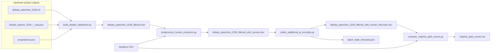

# Human extraction (`human_extraction/`): experiment and data flow

This document describes **what the pipeline measures** and **where each main artifact comes from** in its **current** form. The focus is topic **3234**: one proposition, **100** debate arguments (5 initial stances × 20 replications), with **AI** and **human** “extraction” profiles (distributions over stance labels A–E) and diagnostics for comparing them.

---

## What the experiment is doing

- **Unit of analysis:** One **row** = one **generated argument** for a fixed proposition, with a known **initial stance** (A–E) and **rep** id (0–19 within that stance).
- **AI extraction:** From the main modeling pipeline, a **5-way probability vector** `prob_AI_extract_A` … `prob_AI_extract_E` encodes how an LLM “reads” the argument back onto the stance scale (encode-style task). Those values come from structured **raw JSON** (probability tensor) aligned to the speech file.
- **Human extraction:** Independent raters (Qualtrics) assign a stance label per argument; the script turns many raters into **empirical proportions** `prob_human_extraction_A` … `prob_human_extraction_E` per row.
- **Comparison:** Resolved **majority** labels (argmax on each 5-vector, with deterministic A→E tie-break) let you report **AI vs human agreement** and tie rates.
- **9-encode refresh (optional):** To stabilize or resample the **AI** side, the project adds **eight more** independent LLM encode votes per row (same prompt layout, natural A–E option order, **no** option-order shuffle), then recomputes `prob_AI_extract_*` as **vote shares** over **nine** votes total (one vote derived from the **previous** AI probabilities plus eight new discrete votes). Human columns are **unchanged** by this step.

---

## End-to-end flow (artifacts)



---

## `debata_speeches_3234_filtered.xlsx`

| | |
|---|---|
| **Role** | Base table for topic 3234: arguments + **first-pass AI** extraction probabilities. |
| **Produced by** | `build_debate_dataframe.py` |
| **Main inputs** | `human_extraction/debata_speeches_3234.txt` (one line per argument: `Rep n: Generated argument: …`), `propositions.json` (to attach the proposition text), and a **single-key** raw JSON file such as `results/gpt_5_4/debate_speech_3234_gpt_5_4_prompt_1_raw.json` containing a `[rep][initial_stance][extract]` probability tensor. |
| **Row count** | **100** rows: by default `filter_max_rep=19` keeps reps **0–19** for each of five initial stances (5 × 20). |
| **Typical columns** | `proposition`, `argument`, `initial stance`, `rep`, `prob_AI_extract_A` … `prob_AI_extract_E`. |

The script parses the speech file, joins probabilities from the tensor, filters by `rep`, and writes the listed columns to xlsx.

---

## `debata_speeches_3234_filtered_with_human.xlsx`

| | |
|---|---|
| **Role** | Same 100 rows as the filtered workbook, plus **human** extraction proportions and **side-by-side majority / tie** fields for AI vs human. |
| **Produced by** | `postprocess_human_extraction.py` |
| **Main inputs** | `debata_speeches_3234_filtered.xlsx` (read-only) and a **Qualtrics export CSV** with columns `1_Q2` … `100_Q2` (one column per argument, aligned to row order). |
| **Adds** | `prob_human_extraction_A` … `prob_human_extraction_E`; `majority_AI_extract`, `majority_human_extract`; `tie_AI_extract`, `tie_human_extract`; `tied_letters_AI`, `tied_letters_human`. Optional second sheet `summary` if `--summary-sheet`. |
| **Default output path** | Same stem as the filtered file with `_with_human` before `.xlsx` (e.g. `debata_speeches_3234_filtered_with_human.xlsx`). |

Human proportions are **rater counts** normalized per item; AI columns are **unchanged** from the filtered file at this stage.

---

## `debata_speeches_3234_filtered_with_human_9encode.xlsx`

| | |
|---|---|
| **Role** | Same rows and **human** columns as `_with_human.xlsx`, but **AI** extraction columns are **recomputed** after **eight additional** LLM encode votes per row (plus one **discrete** vote inferred from the **previous** `prob_AI_extract_*` row—argmax with A→E tie-break), for a total of **nine** votes per row unless you change `--extra-encodes`. |
| **Produced by** | `collect_additional_ai_encodes.py` |
| **Main input** | `debata_speeches_3234_filtered_with_human.xlsx` (must include `proposition`, `argument`, and `prob_AI_extract_A` … `E`). |
| **API** | One **OpenAI Batch** job per run: `100 × extra_encodes` chat completion lines (default **800** requests for `extra_encodes=8`). Encode prompts use **natural A–E** option order (**no** random option shuffle). |
| **Adds / overwrites** | Updates `prob_AI_extract_*`, `majority_AI_extract`, `tie_AI_extract`, `tied_letters_AI`; adds audit columns such as `ai_base_letter`, `ai_additional_count_*`, `ai_total_count_*`, `ai_total_votes_n`. |

**Recompute rule (current implementation):** for each row, one vote from the **argmax** of the incoming AI probability vector, plus `extra_encodes` votes from the new batch; new `prob_AI_extract_*` = category counts / `(1 + extra_encodes)`.

---

## `batch_state_9encode.json`

| | |
|---|---|
| **Role** | **Checkpoint** for a completed 9-encode batch run: raw API lines plus the **request list** (including `letters_shuffled_encode` per line) so results can be **re-parsed into the xlsx without calling the API again**. |
| **Produced by** | `collect_additional_ai_encodes.py --raw-results-json …` or `run_collect_9encode.sh` when `FROM_RAW=0` (default). Path in the shell script: `human_extraction/batch_state_9encode.json` under `PROJECT_DIR`. |
| **Contents** | JSON object with at least: `version`, `extra_encodes`, `model_name`, `batch_results` (map `custom_id` → batch output line), `requests` (parallel metadata for each line). |
| **Consumed by** | `collect_additional_ai_encodes.py --from-raw-json batch_state_9encode.json` or `run_collect_9encode.sh` with `FROM_RAW=1` (rebuilds the output xlsx only; **no** API key). |

You need **both** `batch_results` and `requests` in the file: recreating requests locally would not match the saved batch unless you replay the same logic and seeds.

---

## Scripts (current)

| Script | Purpose |
|--------|---------|
| `build_debate_dataframe.py` | Build `debata_speeches_3234_filtered.xlsx` from speech text + raw prob tensor + proposition. |
| `postprocess_human_extraction.py` | Merge Qualtrics human labels → `_with_human.xlsx`. |
| `collect_additional_ai_encodes.py` | Batch extra encodes → `_with_human_9encode.xlsx`; optional `--raw-results-json` / `--from-raw-json`. |
| `compute_majority_gold_scores.py` | **Majority-gold** descriptive **mean** and **SE** for humans vs `majority_human_extract`, and AI survey-level mean / propagated **SE** from `ai_total_count_*` (9-encode workbook); writes `majority_gold_scores.csv` (see below). |

Cluster helper: `run_collect_9encode.sh` (loads conda env, sets `INPUT_XLSX` / `OUTPUT_XLSX` / `RAW_STATE_JSON`, supports `FROM_RAW`).

---

## Qualtrics CSV notes (for `postprocess_human_extraction.py`)

- Data rows are detected by a **date-like** first column (`YYYY-MM-DD`).
- Question columns are expected as `1_Q2` … `100_Q2`.
- Cell values are parsed for a leading `A)` … `E)` style label.

---

## Majority-gold descriptive mean and SE (`compute_majority_gold_scores.py`)

This is separate from the **row-level** “majority AI == majority human” accuracy printed by `postprocess_human_extraction.py`. It summarizes **agreement with the human crowd label** on a **survey-level** scale, with **standard errors** that are meant to be **comparable** (both are uncertainties for a **mean**-type summary, not SD across unrelated units).

### Gold standard \(G_i\)

- Per row \(i\), **\(G_i\)** = `majority_human_extract`: argmax on `prob_human_extraction_A` … `E` with the same **A → E tie-break** as `postprocess_human_extraction.py` (`tie_human_extract` / `tied_letters_human` flag ties before resolution).

### Human cohort

- For each Qualtrics respondent \(p\), **score\(_p\)** = fraction of items (100 columns `1_Q2` … `100_Q2`, aligned to workbook row order) whose parsed letter equals **\(G_i\)** on that item. Default: missing / unparsable cells count as wrong (denominator 100); `--missing-exclude` averages only over items with a valid letter.
- **Outputs:** **mean** of score\(_p\); **SE(mean)** = sample SD(score\(_p\), `ddof=1`) / \(\sqrt{N}\) over respondents with finite scores (primary uncertainty for \(\bar{H}\)). The CSV also includes **SD between participants** as descriptive spread (not the same quantity as the AI propagated SE).

### AI survey-level (9-encode workbook required)

- Uses **`ai_total_count_*`** and **`ai_total_votes_n`** from `_with_human_9encode.xlsx` (not `majority_AI_extract`). For row \(i\), \(X_i\) = (count of votes equal to \(G_i\)) / `ai_total_votes_n` (expected 9).
- **\(S_{\text{AI}}\)** = mean of \(X_i\) over the 100 rows (same 0–1 scale as a human participant score).
- **Propagated SE(\(S_{\text{AI}}\))** = \((1/100)\,\sqrt{\sum_i \widehat{\mathrm{Var}}(X_i)}\) with \(\widehat{\mathrm{Var}}(X_i) = \hat{p}_i(1-\hat{p}_i)/(n-1)\), \(\hat{p}_i = X_i\), \(n\) = votes per row. **Assumptions** (stated in script output and CSV): (1) **across items**, \(X_i\) treated as uncorrelated for propagation; (2) **within item**, Bernoulli / exchangeable encodes at rate \(p_i\). See the script docstring for the distinction between this SE and the **sample SD of the \(n\) binary votes** per row.

### Output file

- Default **`human_extraction/majority_gold_scores.csv`**: one row with means, SEs, paths, `n_items`, `ai_n_votes_per_row`, formula note, and assumption strings. Override with `--output-csv`.

---

## Example commands

Build filtered xlsx:

```bash
python human_extraction/build_debate_dataframe.py --topic-id 3234 --speech-file human_extraction/debata_speeches_3234.txt --raw-json-file results/gpt_5_4/debate_speech_3234_gpt_5_4_prompt_1_raw.json --output-file human_extraction/debata_speeches_3234_filtered.xlsx
```

Merge human extraction:

```bash
python human_extraction/postprocess_human_extraction.py --human-csv "path/to/Human_Extraction_export.csv" --summary-sheet
```

Collect eight extra AI encodes and write batch state + 9-vote workbook:

```bash
python human_extraction/collect_additional_ai_encodes.py --input-xlsx human_extraction/debata_speeches_3234_filtered_with_human.xlsx --output-xlsx human_extraction/debata_speeches_3234_filtered_with_human_9encode.xlsx --model-name gpt-5.4 --extra-encodes 8 --batch --raw-results-json human_extraction/batch_state_9encode.json
```

SLURM (see `run_collect_9encode.sh` for `FROM_RAW` and paths):

```bash
sbatch run_collect_9encode.sh
```

Majority-gold mean / SE and CSV (requires `_with_human_9encode.xlsx` + Qualtrics CSV):

```bash
python human_extraction/compute_majority_gold_scores.py \
  --human-csv "path/to/Human_Extraction_export.csv" \
  --xlsx-9encode human_extraction/debata_speeches_3234_filtered_with_human_9encode.xlsx \
  --output-csv human_extraction/majority_gold_scores.csv
```

---

## Validation checks (`collect_additional_ai_encodes.py`)

- Exactly **100** rows; single unique `proposition`; required columns present.
- After the batch: **exactly** `extra_encodes` parsed votes per row.
- Recomputed AI probabilities sum to **1.0** per row; total vote count = `1 + extra_encodes`.
